# Picktory 아키텍처 다이어그램 (현재 구현 기준)

> **기준:** `lib/` 175개 Dart 파일 · MVVM + `ChangeNotifier` + `go_router` + `ServiceLocator`  
> **데이터:** Phase 3 전 `Dummy*Repository` 더미 구현

---

## 1. 레이어 구조도 (Class Diagram 유사)

```mermaid
classDiagram
    direction TB

    class PicktoryApp {
        +createRouter()
    }
    class ServiceLocator {
        +init()
        Repositories
        Shell ViewModels
    }
    class AppRouter {
        +rootNavigatorKey
        +routeObserver
        +create() GoRouter
    }
    class AppRoute {
        <<enumeration>>
        32 routes
    }

    PicktoryApp --> AppRouter
    AppRouter --> AppRoute
    AppRouter --> ServiceLocator

    namespace Models {
        class UserProfile
        class UserPreference
        class HomeFeed
        class Mission
        class MissionDetail
        class MissionParticipationResult
        class CommunityPost
        class CommunityComment
        class UserMission
        class RankingFeed
        class MyPageSummary
        class NotificationSettings
        class AuthSession
        class SignupDraft
        class TvProgram
    }

    namespace Services_Abstract {
        class AuthRepository
        class SignupRepository
        class UserPreferenceRepository
        class HomeRepository
        class MissionRepository
        class CommunityRepository
        class RankingRepository
        class MyRepository
        class NotificationRepository
        class StoryRepository
        class TvProgramRepository
    }

    namespace Services_Dummy {
        class DummyAuthRepository
        class DummySignupRepository
        class DummyUserPreferenceRepository
        class DummyHomeRepository
        class DummyMissionRepository
        class DummyCommunityRepository
        class DummyRankingRepository
        class DummyMyRepository
        class DummyNotificationRepository
        class DummyStoryRepository
        class DummyTvProgramRepository
        class DummyDataProvider
        class DummyCommunityData
        class DummyRankingData
    }

    namespace ViewModels {
        class SplashViewModel
        class LoginViewModel
        class HomeViewModel
        class MissionDetailViewModel
        class CommunityFeedViewModel
        class RankingViewModel
        class MyViewModel
    }

    namespace Views {
        class MainShellView
        class HomeView
        class MissionDetailView
        class CommunityFeedView
        class RankingView
        class MyView
    }

    AuthRepository <|.. DummyAuthRepository
    SignupRepository <|.. DummySignupRepository
    UserPreferenceRepository <|.. DummyUserPreferenceRepository
    HomeRepository <|.. DummyHomeRepository
    MissionRepository <|.. DummyMissionRepository
    CommunityRepository <|.. DummyCommunityRepository
    RankingRepository <|.. DummyRankingRepository
    MyRepository <|.. DummyMyRepository
    NotificationRepository <|.. DummyNotificationRepository
    StoryRepository <|.. DummyStoryRepository
    TvProgramRepository <|.. DummyTvProgramRepository

    ServiceLocator --> Services_Abstract
    ServiceLocator --> ViewModels

    SplashViewModel --> AuthRepository
    HomeViewModel --> HomeRepository
    HomeViewModel --> UserPreferenceRepository
    MissionDetailViewModel --> MissionRepository
    CommunityFeedViewModel --> CommunityRepository
    RankingViewModel --> RankingRepository
    MyViewModel --> MyRepository

    HomeView --> HomeViewModel
    MissionDetailView --> MissionDetailViewModel
    CommunityFeedView --> CommunityFeedViewModel
    RankingView --> RankingViewModel
    MyView --> MyViewModel

    HomeViewModel ..> HomeFeed
    MissionDetailViewModel ..> MissionDetail
    CommunityFeedViewModel ..> CommunityPost
    MyViewModel ..> MyPageSummary
```


---

## 2. 패키지·폴더 구조도

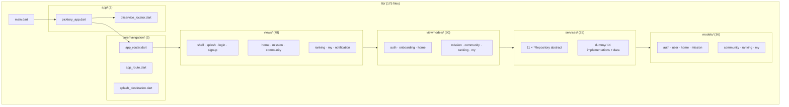


| 레이어                | 역할                                        | 파일 수 |
| ------------------ | ----------------------------------------- | ---- |
| `models/`          | 도메인 데이터·enum                              | 36   |
| `services/`        | Repository 인터페이스 + Dummy                  | 25   |
| `viewmodels/`      | `ChangeNotifier` 상태·비즈니스                  | 30   |
| `views/`           | UI (`StatelessWidget` / `StatefulWidget`) | 78   |
| `core/navigation/` | `go_router` 라우트 정의                        | 3    |


---

## 3. ServiceLocator 의존성 맵

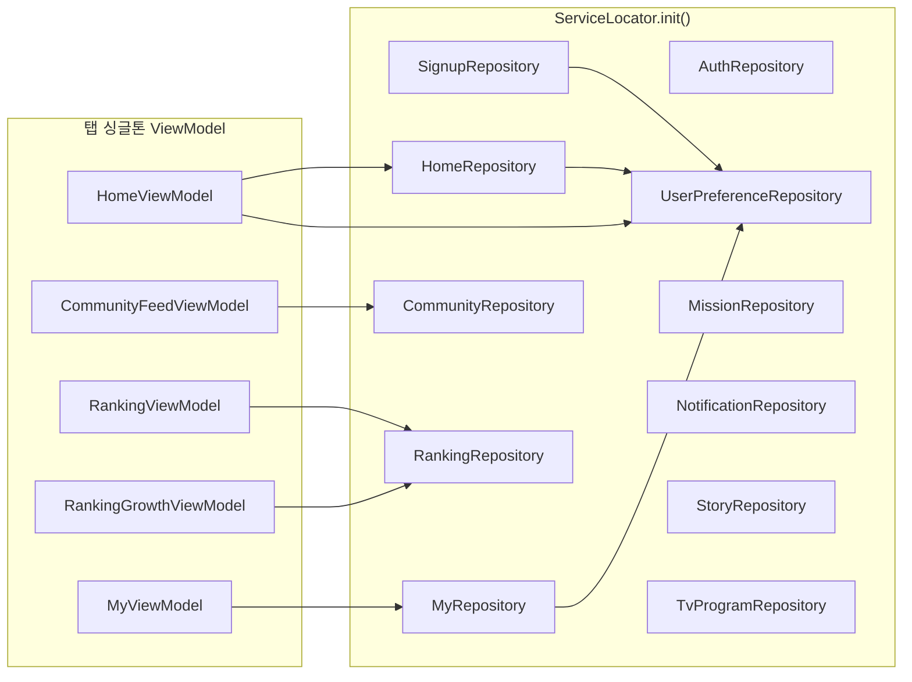


**라우터에서 화면별 생성 (비싱글톤):**  
`SplashViewModel`, `LoginViewModel`, `MissionDetailViewModel`, `CommunityPostDetailViewModel`, `MyPickHistoryViewModel` 등 — `app_router.dart` `builder` 내부

---

## 4. ViewModel ↔ Repository 전체 매핑

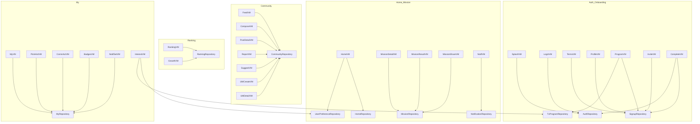


---

## 5. Activity Diagram — 앱 시작·인증·온보딩

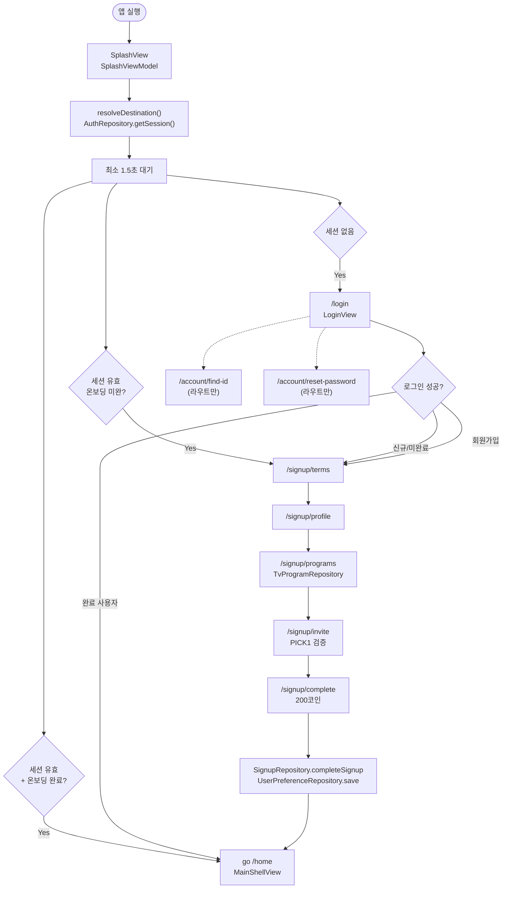


---

## 6. Activity Diagram — 메인 셸·하단 탭

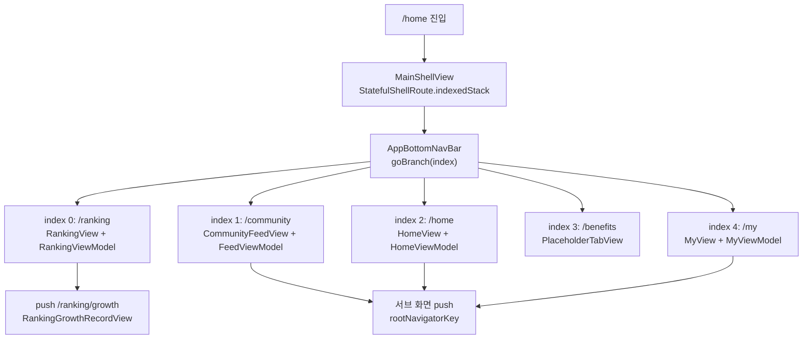


---

## 7. Activity Diagram — 홈 & 미션 플로우 (H-1, M-1~M-5, N-1)

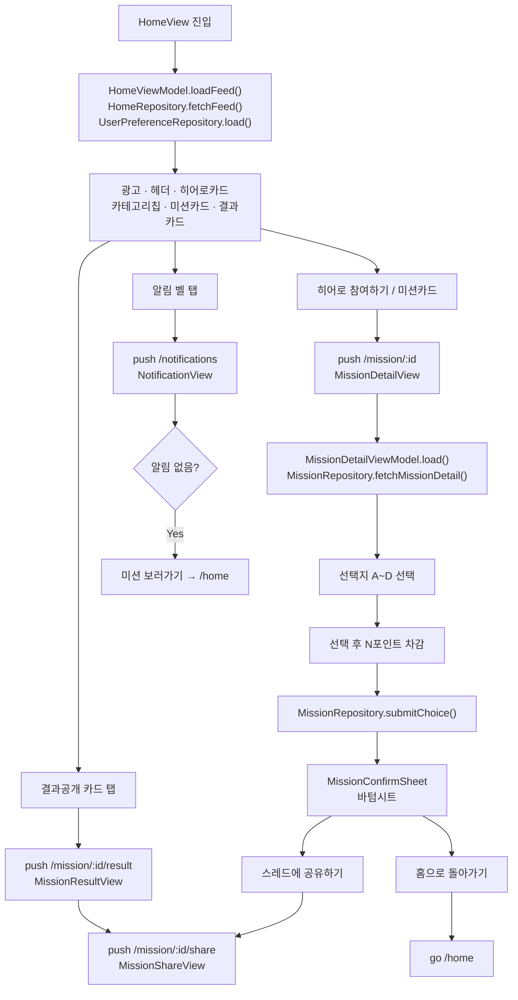


---

## 8. Activity Diagram — 커뮤니티 (C-1~C-5, 스레드 상세, UM)

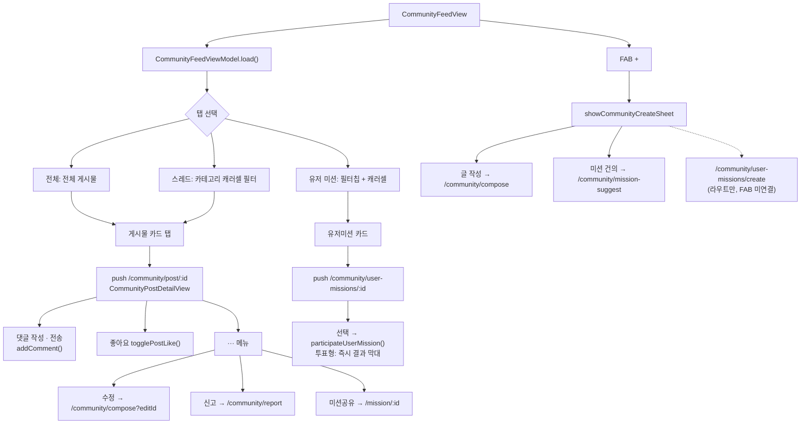


---

## 9. Activity Diagram — 랭킹 (R-1, R-2)

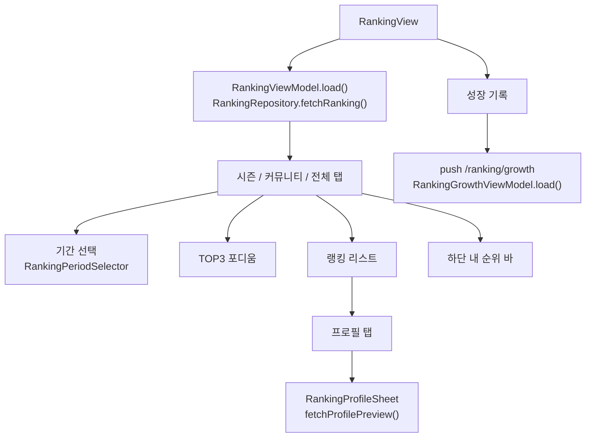


---

## 10. Activity Diagram — 마이페이지·환경설정

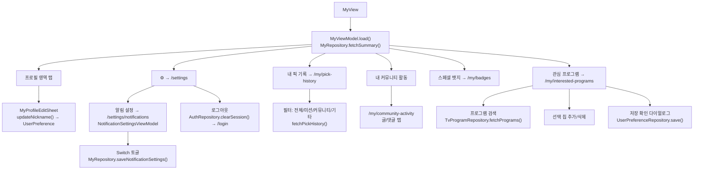


---

## 11. 화면–ViewModel–Route 매트릭스


| 화면 ID    | View                       | ViewModel                       | Route                          | Repository                     |
| -------- | -------------------------- | ------------------------------- | ------------------------------ | ------------------------------ |
| Splash   | `SplashView`               | `SplashViewModel`               | `/`                            | `AuthRepository`               |
| Login    | `LoginView`                | `LoginViewModel`                | `/login`                       | `AuthRepository`               |
| O-2~O-7  | `TermsView` 등              | 각 VM                            | `/signup/*`                    | `SignupRepository`             |
| H-1      | `HomeView`                 | `HomeViewModel` ★               | `/home`                        | `HomeRepository`               |
| N-1      | `NotificationView`         | `NotificationViewModel`         | `/notifications`               | `NotificationRepository`       |
| M-1      | `MissionDetailView`        | `MissionDetailViewModel`        | `/mission/:id`                 | `MissionRepository`            |
| M-4      | `MissionResultView`        | `MissionResultViewModel`        | `/mission/:id/result`          | `MissionRepository`            |
| M-5      | `MissionShareView`         | `MissionShareViewModel`         | `/mission/:id/share`           | `MissionRepository`            |
| C-1      | `CommunityFeedView`        | `CommunityFeedViewModel` ★      | `/community`                   | `CommunityRepository`          |
| C-2      | `CommunityPostDetailView`  | `CommunityPostDetailViewModel`  | `/community/post/:id`          | `CommunityRepository`          |
| C-3      | `CommunityComposeView`     | `CommunityComposeViewModel`     | `/community/compose`           | `CommunityRepository`          |
| C-4      | `MissionSuggestView`       | `MissionSuggestViewModel`       | `/community/mission-suggest`   | `CommunityRepository`          |
| UM-4     | `UserMissionDetailView`    | `UserMissionDetailViewModel`    | `/community/user-missions/:id` | `CommunityRepository`          |
| R-1      | `RankingView`              | `RankingViewModel` ★            | `/ranking`                     | `RankingRepository`            |
| R-2      | `RankingGrowthRecordView`  | `RankingGrowthViewModel` ★      | `/ranking/growth`              | `RankingRepository`            |
| My       | `MyView`                   | `MyViewModel` ★                 | `/my`                          | `MyRepository`                 |
| Settings | `SettingsView`             | —                               | `/settings`                    | `AuthRepository` (logout)      |
| 관심 프로그램  | `MyInterestedProgramsView` | `MyInterestedProgramsViewModel` | `/my/interested-programs`      | `UserPreference` + `TvProgram` |


★ = `ServiceLocator` 싱글톤 (탭 또는 공유 VM)

---

## 12. 네비게이션 트리 (push vs tab)

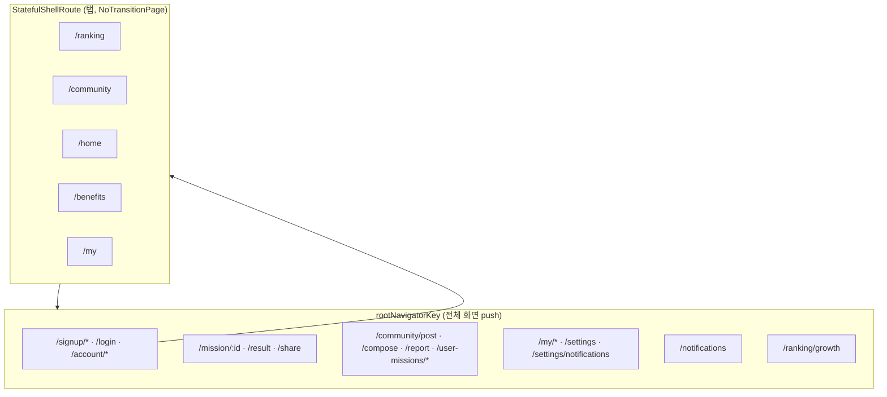


---

## 13. 데이터 구조도 — 도메인 개요

`lib/models/` **36개 파일** · 엔티티 클래스 **약 45개** · enum **약 20개**

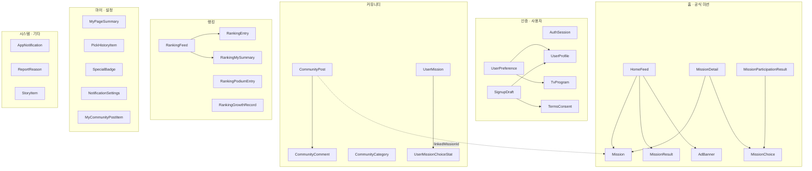

---

## 14. 개념 ER 다이어그램 (관계)

> 로컬 더미 저장 구조 기준. 실제 DB 스키마는 아님.

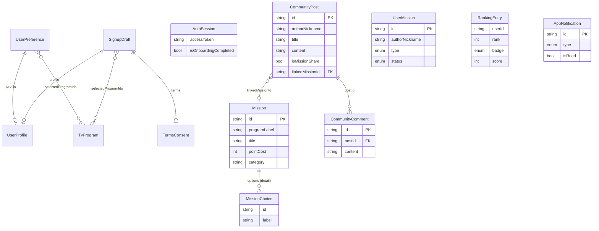

### ID 참조 맵 (화면 간 연결)

| From | Field | To | 용도 |
|------|-------|-----|------|
| `CommunityPost` | `linkedMissionId` | `Mission.id` | 미션 공유 글 → 미션 상세 |
| `CommunityComment` | `postId` | `CommunityPost.id` | 댓글 소속 |
| `MissionParticipationResult` | `missionId` | `Mission.id` | 참여 결과 조회 |
| `UserPreference` | `selectedProgramIds` | `TvProgram.id` | 관심 프로그램 |
| `SignupDraft` | `selectedProgramIds` | `TvProgram.id` | 가입 시 선택 |
| `StoryItem` | `id` | `Mission.id` 등 | 레거시 (동일 id 재사용) |

---

## 15. 클래스 상세 — 인증 · 사용자

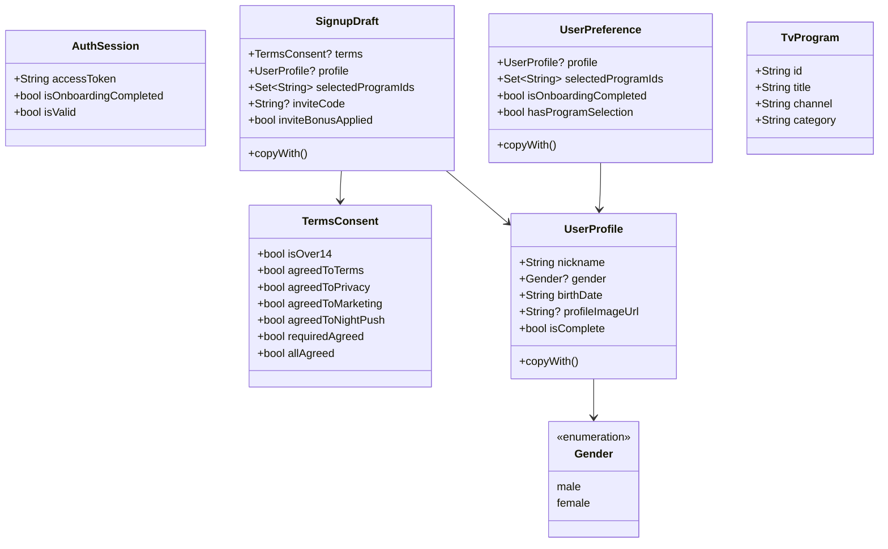

| 모델 | 파일 | Repository |
|------|------|------------|
| `AuthSession` | `auth_session.dart` | `AuthRepository` |
| `SignupDraft` | `signup_draft.dart` | `SignupRepository` (메모리) |
| `UserPreference` | `user_preference.dart` | `UserPreferenceRepository` |
| `TvProgram` | `tv_program.dart` | `TvProgramRepository` |

---

## 16. 클래스 상세 — 홈 · 공식 미션

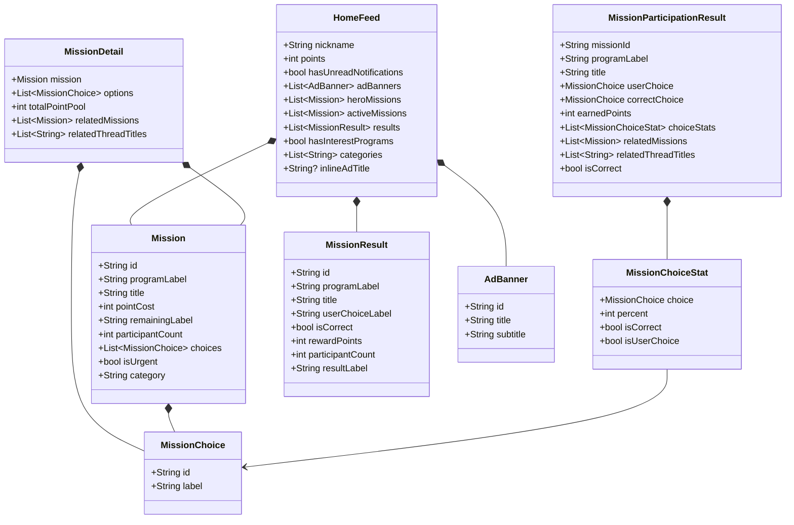

| 응답 DTO | 구성 | 생성 |
|----------|------|------|
| `HomeFeed` | 피드 집계 | `HomeRepository.fetchFeed()` |
| `MissionDetail` | 상세 + 선택지 4개 | `MissionRepository.fetchMissionDetail()` |
| `MissionParticipationResult` | 참여·결과 | `MissionRepository.submitChoice()` / `fetchParticipationResult()` |

---

## 17. 클래스 상세 — 커뮤니티

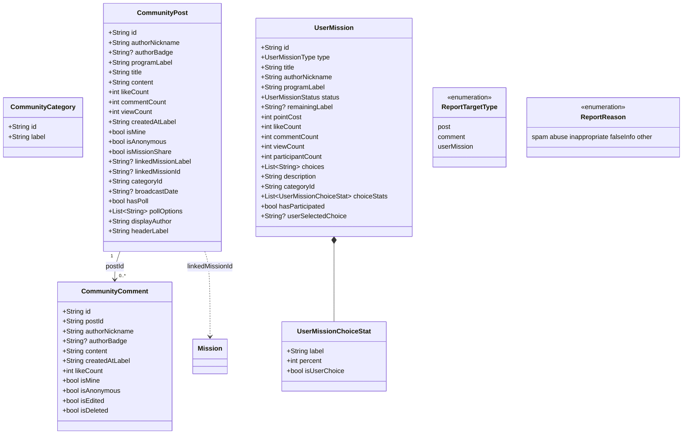

### 커뮤니티 enum

| Enum | 값 | 용도 |
|------|-----|------|
| `UserMissionType` | `mission`, `poll` | UM-4a / UM-4b |
| `UserMissionStatus` | `active`, `closed` | 목록 필터 |
| `UserMissionFilter` | `all`, `active`, `closed`, `mine` | 칩 필터 |
| `UserMissionSort` | `latest`, `popular`, `participants`, `views` | 정렬 |
| `CommunityFeedTab` | `all`, `thread`, `userMission` | C-1 탭 (ViewModel) |

### Dummy 저장 구조 (`DummyCommunityRepository`)

```
_posts: List<CommunityPost>
_comments: Map<postId, List<CommunityComment>>
_userMissions: List<UserMission>
_likedPosts: Set<postId>
_likedComments: Set<commentId>
_blockedUsers: Set<nickname>
```

---

## 18. 클래스 상세 — 랭킹

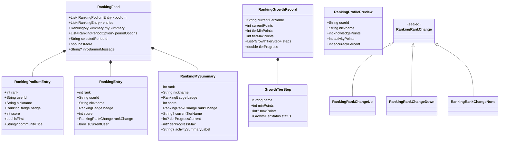

| Enum | 값 |
|------|-----|
| `RankingMainTab` | `season`, `community`, `overall` |
| `RankingBadge` | `bronze`, `silver`, `gold`, `master`, `legend` |
| `RankingSpecialBadge` | `legend`, `accuracyKing`, `seasonComplete` |
| `GrowthTierStatus` | `completed`, `inProgress`, `locked` |

---

## 19. 클래스 상세 — 마이 · 알림 · 기타

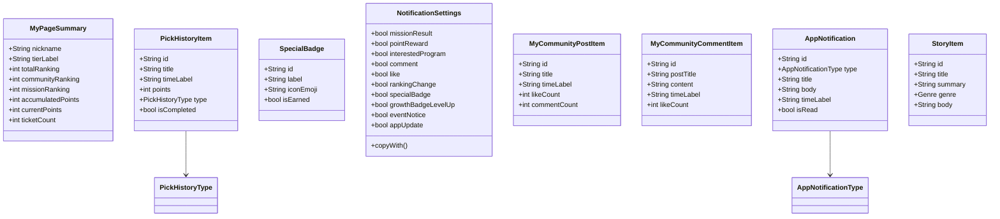

| Enum | 값 |
|------|-----|
| `PickHistoryFilter` | `all`, `mission`, `community`, `other` |
| `PickHistoryType` | `mission`, `community`, `other` |
| `AppNotificationType` | `result`, `mission`, `reward`, `ranking` |
| `Genre` | `fantasy`, `romance`, `mystery`, `sf`, `horror`, `daily` |

---

## 20. Aggregate vs Entity 구분

| 유형 | 모델 | 설명 |
|------|------|------|
| **Entity** | `Mission`, `CommunityPost`, `UserMission`, `TvProgram` | 단일 도메인 객체, CRUD 대상 |
| **Value** | `MissionChoice`, `AdBanner`, `CommunityCategory` | 불변 값, ID만으로 식별 |
| **Aggregate Response** | `HomeFeed`, `MissionDetail`, `RankingFeed`, `MyPageSummary` | API/Repository 응답용 조합 |
| **View DTO** | `MyCommunityPostItem`, `RankingProfilePreview` | 화면 전용 축약 모델 |
| **Settings** | `NotificationSettings`, `TermsConsent` | 플래그 묶음, `copyWith` 지원 |
| **Sealed** | `RankingRankChange` | 변형별 순위 변동 표현 |

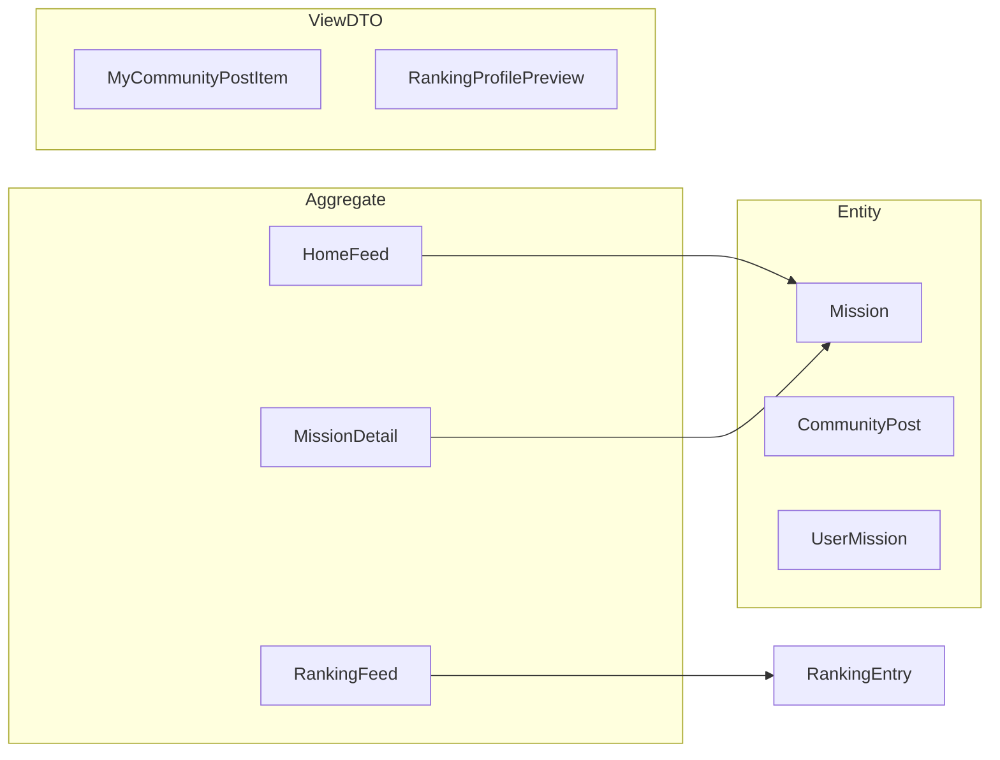

---

## 21. Repository ↔ 모델 매핑表

| Repository | 주요 반환/입력 모델 |
|------------|-------------------|
| `AuthRepository` | `AuthSession` |
| `SignupRepository` | `SignupDraft`, `TermsConsent`, `UserProfile` |
| `UserPreferenceRepository` | `UserPreference`, `UserProfile` |
| `TvProgramRepository` | `List<TvProgram>` |
| `HomeRepository` | `HomeFeed` → `Mission`, `MissionResult`, `AdBanner` |
| `MissionRepository` | `MissionDetail`, `MissionParticipationResult` |
| `CommunityRepository` | `CommunityPost`, `CommunityComment`, `UserMission`, `CommunityCategory` |
| `RankingRepository` | `RankingFeed`, `RankingProfilePreview`, `RankingGrowthRecord` |
| `MyRepository` | `MyPageSummary`, `PickHistoryItem`, `SpecialBadge`, `NotificationSettings`, `MyCommunity*` |
| `NotificationRepository` | `List<AppNotification>` |
| `StoryRepository` | `StoryItem` |

---

## 22. 구현 상태 요약


| 영역             | 와이어프레임 | 구현도         | 비고                   |
| -------------- | ------ | ----------- | -------------------- |
| 온보딩 O-1~O-7    | ✅      | 완료          | 소셜 로그인 UI            |
| 홈 H-1 + 미션 M/N | ✅      | 완료          | 다크 테마                |
| 커뮤니티 C-1~C-5   | ✅      | 완료          | UM 생성 FAB 미연결        |
| 랭킹 R-1/R-2     | ✅      | 완료          |                      |
| 마이 + 설정        | ✅      | 완료          |                      |
| 혜택 탭           | —      | Placeholder | `PlaceholderTabView` |
| Story 상세       | 레거시    | 라우트만        | `/story/:id`         |


---

## 23. 전체 화면 흐름도 (IA 기준 Screen Flow)

> IA 섹션별로 색상 코딩한 전체 화면 흐름. 32개 라우트 + 주요 모달/시트 포함.
>
> - **Auth/Onboarding(O)** = 네이비
> - **Home/Mission(H/M)** = 블루
> - **Notification(N)** = 보라
> - **Community(C/UM)** = 핑크
> - **Ranking(R)** = 레드
> - **Benefits(B)** = 옐로우
> - **My/Settings(MY/S)** = 틸
> - **Modal/Sheet** = 라이트 핑크 (점선 연결)

### 23-1. 전체 흐름 — Bird's-eye view

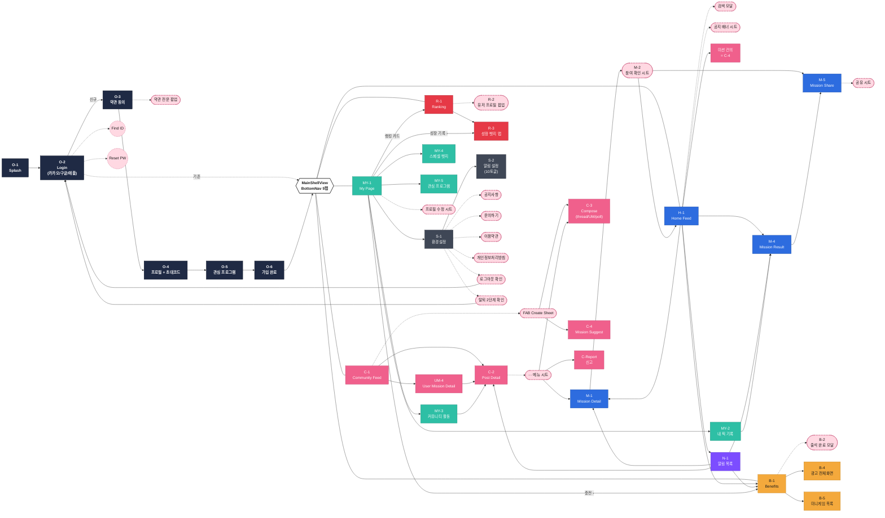

---

### 23-2. Auth / Onboarding 상세 (O-1 ~ O-6)

```mermaid
flowchart LR
    classDef auth fill:#1F2A44,stroke:#0D1424,color:#FFFFFF,font-weight:bold
    classDef shell fill:#2D6CDF,stroke:#1B4DA3,color:#FFFFFF,font-weight:bold
    classDef modal fill:#FFD8E2,stroke:#C03A66,color:#1A1A1A,stroke-dasharray:4 3
    classDef decision fill:#FFFFFF,stroke:#1A1A1A,color:#1A1A1A

    A([앱 실행]) --> O1["O-1<br/>Splash<br/>1.5s"]:::auth
    O1 --> D1{세션?}:::decision
    D1 -->|valid + 완료| HOME["MainShell<br/>/home"]:::shell
    D1 -->|valid + 미완| O3
    D1 -->|없음| O2["O-2<br/>Social Login"]:::auth

    O2 --> O2K["카카오로 계속하기"]:::auth
    O2 --> O2G["구글로 계속하기"]:::auth
    O2 --> O2A["애플로 계속하기"]:::auth
    O2 -.-> O2Find(["Find ID / Reset PW"]):::modal

    O2K --> D2{신규?}:::decision
    O2G --> D2
    O2A --> D2
    D2 -->|기존| HOME
    D2 -->|신규| O3

    O3["O-3<br/>약관 동의<br/>(전체 + 필수3 + 선택2)"]:::auth
    O3 -.-> O3Doc(["보기 → 약관 전문<br/>fullscreenDialog"]):::modal
    O3 --> O4

    O4["O-4<br/>프로필 + 초대코드<br/>(사진/닉네임/성별/생일/코드)"]:::auth
    O4 -.-> O4Pic(["프로필 사진<br/>카메라/앨범"]):::modal
    O4 -.-> O4Nick(["닉네임 중복확인"]):::modal
    O4 -.-> O4Code(["초대코드 검증"]):::modal
    O4 --> O5

    O5["O-5<br/>관심 프로그램<br/>(검색 + 필터 + 카드)"]:::auth
    O5 --> O6

    O6["O-6<br/>가입 완료<br/>닉네임 환영<br/>+100 Pick (+100 보너스)"]:::auth
    O6 --> HOME
```

---

### 23-3. Home / Mission / Notification 상세 (H-1, M-1~M-5, N-1)

```mermaid
flowchart LR
    classDef home fill:#2D6CDF,stroke:#1B4DA3,color:#FFFFFF
    classDef notif fill:#7C4DFF,stroke:#5A35CC,color:#FFFFFF
    classDef community fill:#F0608C,stroke:#C03A66,color:#FFFFFF
    classDef benefits fill:#F4A93C,stroke:#C0801C,color:#1A1A1A
    classDef modal fill:#FFD8E2,stroke:#C03A66,color:#1A1A1A,stroke-dasharray:4 3
    classDef extern fill:#E0E7F1,stroke:#5A6B82,color:#1A1A1A

    subgraph H["Home (H-1)"]
        H1["H-1<br/>홈 메인"]:::home
        HBell(["벨 아이콘"]):::modal
        HSearch(["🔍 검색"]):::modal
        HHero["히어로 슬라이드<br/>최대 4개"]:::home
        HCard["미션 카드"]:::home
        HResult["결과 공개 카드"]:::home
        HNotice["공지 배너"]:::modal
        HSuggest["새 미션 건의<br/>점선 카드"]:::home
        HPick["Pick 잔고 칩"]:::home

        H1 --- HBell
        H1 --- HSearch
        H1 --- HHero
        H1 --- HCard
        H1 --- HResult
        H1 --- HNotice
        H1 --- HSuggest
        H1 --- HPick
    end

    HBell --> N1["N-1<br/>알림 목록<br/>(8가지 타입)"]:::notif
    HPick --> BENE["B-1<br/>혜택 탭"]:::benefits
    HNotice --> BENE
    HSuggest --> C4["C-4<br/>미션 건의"]:::community

    HHero --> M1
    HCard --> M1
    HResult --> M4

    M1["M-1<br/>Mission Detail<br/>선택지 A~D"]:::home
    M1 --> M2(["M-2<br/>참여 확인 시트<br/>· 스레드 공유<br/>· 홈으로 돌아가기"]):::modal
    M2 --> M5["M-5<br/>Mission Share<br/>(미션 미리보기 +<br/>카테고리 + 콘텐츠)"]:::home
    M2 --> H1

    M4["M-4<br/>Mission Result<br/>참여율 막대"]:::home
    M4 --> M5
    M5 -.-> M5Share(["공유 시트<br/>링크/카톡/인스타"]):::modal
    M5 --> C2["C-2<br/>Post Detail"]:::community

    N1 -->|결과/마감/신미션| M4
    N1 -->|댓글| C2
    N1 -->|보상/이벤트| BENE
    N1 -->|랭킹| RANK["R-1<br/>Ranking"]:::extern
    N1 -->|출석 리마인드| BENE
```

---

### 23-4. Community 상세 (C-1 ~ C-5, UM-1 ~ UM-4)

```mermaid
flowchart LR
    classDef community fill:#F0608C,stroke:#C03A66,color:#FFFFFF
    classDef modal fill:#FFD8E2,stroke:#C03A66,color:#1A1A1A,stroke-dasharray:4 3
    classDef extern fill:#E0E7F1,stroke:#5A6B82,color:#1A1A1A

    subgraph CMain["Community Feed (C-1)"]
        C1["C-1<br/>피드 메인"]:::community
        CTab1["전체"]:::community
        CTab2["스레드<br/>+ 카테고리 캐러셀"]:::community
        CTab3["유저 미션<br/>+ 필터칩"]:::community
        CFab(["+ FAB<br/>Create Sheet"]):::modal
        C1 --- CTab1
        C1 --- CTab2
        C1 --- CTab3
        C1 --- CFab
    end

    CFab --> C3["C-3<br/>Compose<br/>(스레드/유저미션/유저투표)"]:::community
    CFab --> C4["C-4<br/>미션 건의"]:::community

    CTab1 --> C2
    CTab2 --> C2
    CTab3 --> UM4

    C2["C-2<br/>Post Detail<br/>댓글 · 좋아요"]:::community
    C2 -.-> CMore(["··· 메뉴 시트"]):::modal
    CMore --> C3
    CMore --> CReport["C-Report<br/>신고"]:::community
    CMore --> CMission["원본 미션 보기<br/>→ M-1"]:::extern

    UM4["UM-4<br/>User Mission Detail<br/>선택지 → 즉시 결과 막대"]:::community
    UM4 --> C2

    C3 -->|작성 완료| C2
    C4 -->|건의 완료| C1
```

---

### 23-5. Benefits / Ranking 상세 (B-1 ~ B-5, R-1 ~ R-3)

```mermaid
flowchart LR
    classDef benefits fill:#F4A93C,stroke:#C0801C,color:#1A1A1A
    classDef ranking fill:#E63946,stroke:#A8202C,color:#FFFFFF
    classDef modal fill:#FFD8E2,stroke:#C03A66,color:#1A1A1A,stroke-dasharray:4 3

    subgraph Bsec["Benefits"]
        B1["B-1<br/>혜택 메인<br/>출석·광고·미니게임"]:::benefits
        B1Att["출석체크 카드<br/>7일 + 🔥 연속"]:::benefits
        B1Ad["광고 카드<br/>잔여 3회"]:::benefits
        B1Game["미니게임 카드<br/>Coming Soon"]:::benefits
        B1 --- B1Att
        B1 --- B1Ad
        B1 --- B1Game
    end

    B1Att --> B2(["B-2<br/>출석 완료 모달<br/>+N Pick · 7일 달력"]):::modal
    B1Ad --> B4["B-4<br/>광고 전체화면<br/>(진행바 + 스킵 타이머)"]:::benefits
    B1Game --> B5["B-5<br/>미니게임 목록<br/>Coming Soon 안내"]:::benefits
    B4 -->|완료| B1

    subgraph Rsec["Ranking"]
        R1["R-1<br/>랭킹 메인<br/>시즌·커뮤니티·전체 탭"]:::ranking
        R1Top["TOP3 포디움"]:::ranking
        R1List["순위 리스트"]:::ranking
        R1Bar["내 순위 바<br/>하단 고정"]:::ranking
        R1 --- R1Top
        R1 --- R1List
        R1 --- R1Bar
    end

    R1List --> R2(["R-2<br/>유저 프로필 팝업<br/>· 뱃지단계+현재순위<br/>· 시즌/전체/정답률<br/>· 스페셜 뱃지<br/>· 딤 탭 닫기"]):::modal
    R1Bar --> R3["R-3<br/>성장 뱃지 맵<br/>9단계 × 3레벨"]:::ranking
```

---

### 23-6. My Page / Settings 상세 (MY-1 ~ MY-5, S-1 ~ S-2)

```mermaid
flowchart LR
    classDef my fill:#2EBFA5,stroke:#1B8C77,color:#FFFFFF
    classDef settings fill:#3F4756,stroke:#1F2530,color:#FFFFFF
    classDef modal fill:#FFD8E2,stroke:#C03A66,color:#1A1A1A,stroke-dasharray:4 3
    classDef extern fill:#E0E7F1,stroke:#5A6B82,color:#1A1A1A
    classDef danger fill:#E63946,stroke:#A8202C,color:#FFFFFF

    subgraph MYsec["My Page (MY-1)"]
        MY1["MY-1<br/>마이 메인"]:::my
        MY1Set["⚙ 환경설정"]:::my
        MY1Pic["프로필 + ✏ 편집"]:::my
        MY1Rank["랭킹 3종 카드<br/>시즌/전체/커뮤니티"]:::my
        MY1Pick["보유 픽 + 충전 ›"]:::my
        MY1Grow["성장 바 + 성장 기록 ›"]:::my
        MY1Code["내 초대코드 + 복사"]:::my
        MY1Menu["메뉴 4종"]:::my
        MY1 --- MY1Set
        MY1 --- MY1Pic
        MY1 --- MY1Rank
        MY1 --- MY1Pick
        MY1 --- MY1Grow
        MY1 --- MY1Code
        MY1 --- MY1Menu
    end

    MY1Pic -.-> MYEdit(["프로필 수정 시트<br/>닉네임 변경"]):::modal
    MY1Rank --> RANK["R-1<br/>랭킹"]:::extern
    MY1Pick --> BENE["B-1<br/>혜택"]:::extern
    MY1Grow --> RANK_G["R-3<br/>성장 뱃지 맵"]:::extern
    MY1Code -.-> MYCopy(["초대코드가<br/>복사됐어요! 토스트"]):::modal
    MY1Set --> S1

    MY1Menu --> MY2["MY-2<br/>내 픽 기록<br/>전체/정답/오답/대기"]:::my
    MY1Menu --> MY3["MY-3<br/>커뮤니티 활동<br/>글·댓글 탭"]:::my
    MY1Menu --> MY4["MY-4<br/>스페셜 뱃지<br/>획득/미획득 그리드"]:::my
    MY1Menu --> MY5["MY-5<br/>관심 프로그램<br/>검색 + 칩"]:::my

    MY2 --> MissionResult["미션 결과<br/>→ M-4"]:::extern
    MY3 --> PostDetail["글 상세<br/>→ C-2"]:::extern

    subgraph Ssec["Settings"]
        S1["S-1<br/>환경설정"]:::settings
        S1Acc["연결 계정<br/>(카카오/구글/애플)"]:::settings
        S1Ver["앱 버전"]:::settings
        S1 --- S1Acc
        S1 --- S1Ver
    end

    S1 --> S2["S-2<br/>알림 설정<br/>10토글"]:::settings
    S1 -.-> SDocs(["공지/문의/약관/<br/>처리방침"]):::modal
    S1 -.-> SLogout(["로그아웃 확인"]):::modal
    S1 -.-> SWith(["탈퇴 2단계 확인"]):::danger

    SLogout --> AUTH["/login<br/>O-2"]:::extern
    SWith --> AUTH
```

---

### 23-7. 라우팅 스택 분류 (push vs tab)

```mermaid
flowchart TB
    classDef tab fill:#2EBFA5,stroke:#1B8C77,color:#FFFFFF,font-weight:bold
    classDef push fill:#F0608C,stroke:#C03A66,color:#FFFFFF
    classDef root fill:#1F2A44,stroke:#0D1424,color:#FFFFFF,font-weight:bold

    Root[["rootNavigatorKey<br/>전체 화면 push"]]:::root

    subgraph Tabs["StatefulShellRoute · BottomNav 5탭<br/>(NoTransitionPage)"]
        TR["/ranking"]:::tab
        TC["/community"]:::tab
        TH["/home"]:::tab
        TB["/benefits"]:::tab
        TM["/my"]:::tab
    end

    subgraph PushPages["push (rootNavigatorKey)"]
        PAuth["/login · /signup/* · /account/*"]:::push
        PMission["/mission/:id<br/>/result · /share"]:::push
        PComm["/community/post/:id<br/>compose · report<br/>user-missions/:id"]:::push
        PNotif["/notifications"]:::push
        PRank["/ranking/growth"]:::push
        PBenefits["/benefits/ad-watch<br/>/benefits/mini-games"]:::push
        PMy["/my/pick-history<br/>/community-activity<br/>/badges · /interested-programs"]:::push
        PSettings["/settings<br/>/settings/notifications<br/>/settings/notices · inquiry<br/>· terms · privacy"]:::push
    end

    Root --> Tabs
    Root --> PushPages

    Tabs -.->|push| PushPages
```

---

*생성일: 구현 스냅샷 기준 · Mermaid는 GitHub / VS Code / Cursor에서 미리보기 가능*